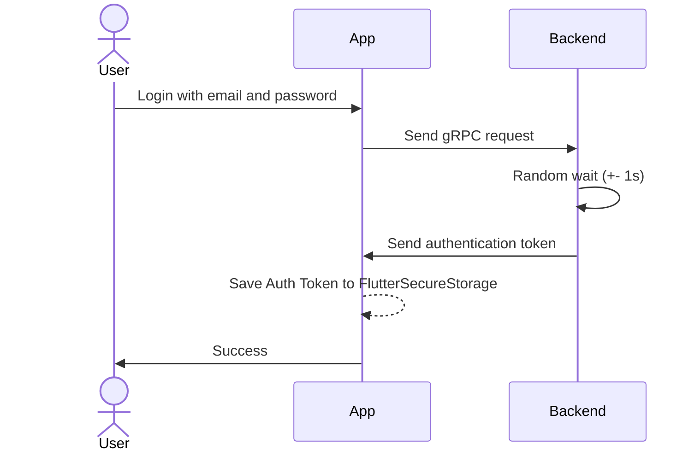
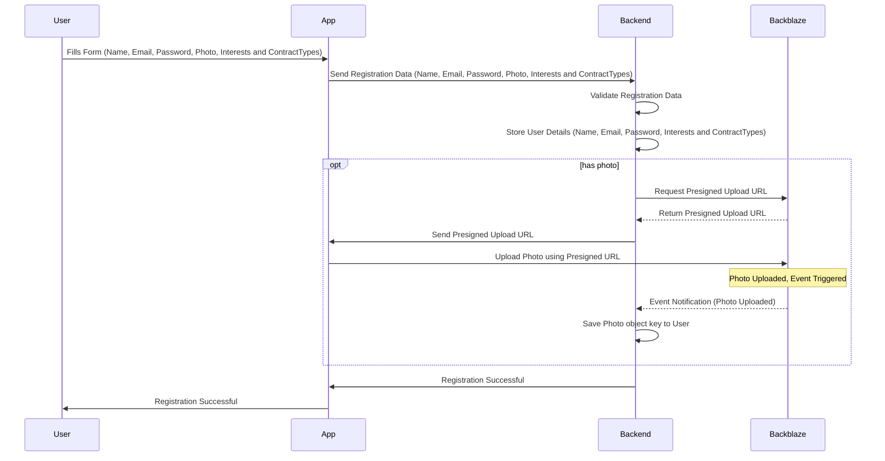

# Autenticação na aplicação

A autenticação na aplicação é feita através de um sistema de autenticação baseado em tokens. O token é gerado pelo backend e enviado para a aplicação, que o guarda no FlutterSecureStorage ou no LocalStorage no caso da aplicação web. O token é utilizado para autenticar o utilizador em todas as chamadas ao backend.

# Registo na aplicação

O utilizador deve registar-se com o nome, email e password. Poderá também adicionar

